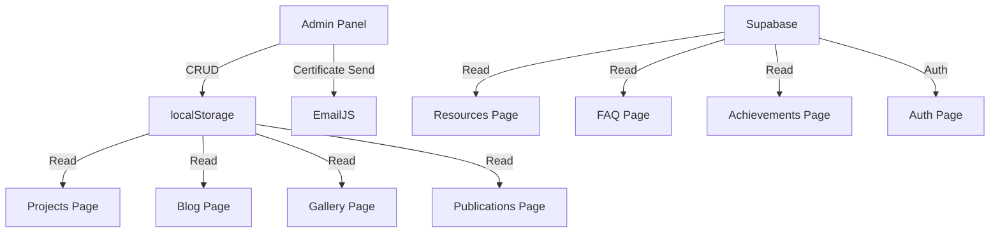

# 19 — Architecture & Design System

## Routing Architecture

All routes are defined in `App.tsx` via `react-router-dom`'s `<BrowserRouter>`:

```
/                  → Index (Homepage)
/projects          → Projects listing
/projects/:id      → Project detail
/projects/:id/live → Project live runner
/events            → Events listing
/events/:id        → Event detail
/blog              → Blog listing
/blog/:slug        → Blog post
/publications      → Research & Publications
/resources         → Learning Resources
/gallery           → Photo Gallery
/faq               → FAQ
/achievements      → Achievements
/join              → Membership Application
/contact           → Contact
/admin             → Admin Panel (Protected)
/auth              → Authentication
*                  → 404 Not Found
```

## Data Architecture



### Storage Split

| Data Type | Store | Why |
|-----------|-------|-----|
| Projects | localStorage | Works offline, no backend setup needed |
| Blog Posts | localStorage | Rapid content creation without DB config |
| Gallery Images | localStorage | Base64-encoded images stored client-side |
| Publications | localStorage | PDFs stored as base64 data URLs |
| Resources | Supabase | Managed server-side by authorised users |
| FAQs | Supabase | Managed server-side, stable data |
| Achievements | Supabase | Managed server-side, infrequent updates |
| Auth Sessions | Supabase | Secure server-side session management |

## Design System

### Theme System

- **Provider**: `next-themes`'s `ThemeProvider` wrapping the entire app
- **Modes**: `light` and `dark` (default: `dark`)
- **Toggle**: Theme switch button in the Navbar

### CSS Architecture

The design system is built on Tailwind CSS with custom extensions:

#### Custom Utility Classes (from `index.css`)
- `.glass` — Glassmorphism: `backdrop-blur-xl` + translucent border + white/dark background
- `.glass-strong` — Stronger glass effect with higher opacity
- `.gradient-text` — Gradient text fill using `background-clip: text`

#### Custom Animations (from `tailwind.config.ts`)
- `animate-float` — Slow vertical bobbing (`translateY(-10px) → translateY(10px)`)
- `animate-soft-pulse` — Gentle scale breathing (`scale(0.95) → scale(1.05)`)
- `animate-shimmer` — Background position shift for shimmer effects

### Color Palette

The theme uses HSL-based CSS custom properties defined in `index.css`:

| Token | Light Mode | Dark Mode |
|-------|-----------|-----------|
| `--background` | Clean white | Deep dark |
| `--primary` | Emerald green | Emerald green |
| `--accent` | Soft green tint | Dark green tint |
| `--muted` | Light grey | Dark grey |
| `--destructive` | Red | Red |

### Component Library

49 shadcn/ui components installed, the most heavily used being:
- `Button`, `Card`, `Badge`, `Input`, `Select` — used across all pages
- `Tabs`, `Accordion` — used for Admin, FAQ, Join
- `Dialog` — used for Gallery lightbox
- `Toast` — used for all CRUD notifications
- `Slider` — used in Certificate Sender

### Responsive Breakpoints

Standard Tailwind responsive system:
- Mobile: default (`< 768px`)
- Tablet: `md:` (`≥ 768px`)
- Desktop: `lg:` (`≥ 1024px`)

### Shared Layout Pattern

Most pages follow this structure:
```tsx
<div className="min-h-screen bg-background">
  <Navbar />
  <main className="pt-24 pb-20 px-4">
    <div className="container mx-auto max-w-6xl">
      {/* Page content */}
    </div>
  </main>
  <Footer />
</div>
```
